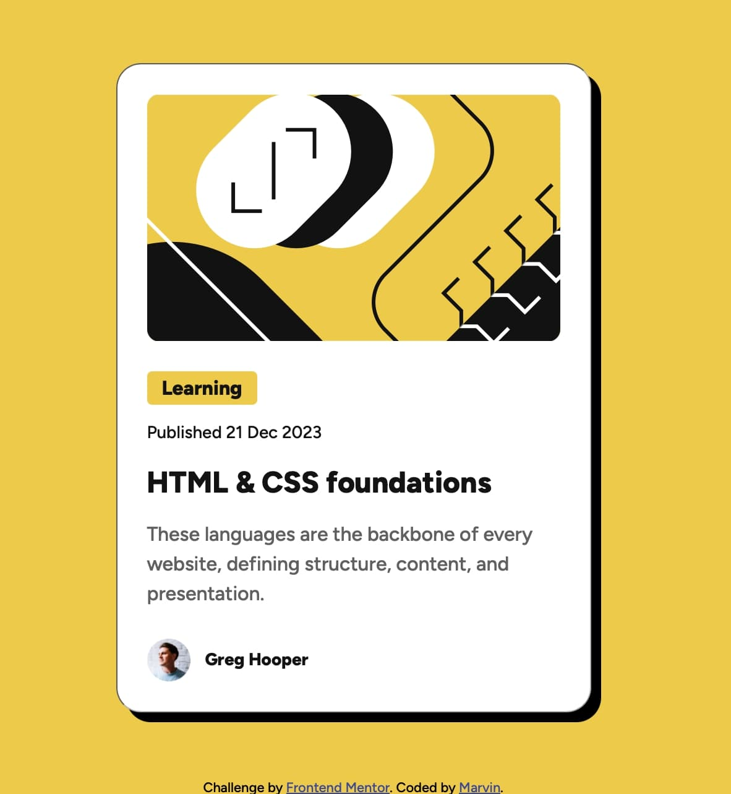

📌 Frontend Mentor - Card Component Challenge

📄 Project Overview

This project is a card component built using HTML & CSS, inspired by a Frontend Mentor challenge. The goal was to create a well-structured and visually appealing card with proper alignment, typography, and hover effects.

🛠 Technologies Used

HTML5 – for structuring the card content.
CSS3 – for styling, layout, and responsiveness.

🎯 Project Features

✅ Custom Design System using CSS variables (:root) for colors, font sizes, and spacing.

✅ Centered Layout using display: flex; justify-content: center; align-items: center;.

✅ Hover Effects for interactive elements like buttons and headings.

✅ Mobile Responsive design with a media query for smaller screens.

✅ Box Shadow & Borders for a modern card appearance.

📷 Project Preview




📌 Process & What I Learned

1️⃣ Structuring the HTML
Used semantic HTML elements like `<button>, <p>, <h2>, and <div>` for better readability.
Organized the card into sections (image, text, button, and avatar).

2️⃣ Styling with CSS
Applied a CSS reset to maintain consistent styling across browsers.
Used CSS variables `(:root)` for colors, font sizes, and spacing to improve reusability.
Implemented flexbox `(display: flex;)` for easy layout and alignment.
Added box shadows and border-radius to enhance the card’s visual appeal.

3️⃣ Centering the Card
Used Flexbox on `<body>` to center the card both vertically and horizontally:

```css
body {
    display: flex;
    justify-content: center;
    align-items: center;
    height: 100vh;
}
```
Ensured that the card remains responsive and adapts to different screen sizes.

4️⃣ Adding Hover Effects for Interactivity
Changed the header color when hovered:

```css
.container .card-details .card-header:hover {
    color: var(--clr-backround);
}
``` 

Added a button hover effect to swap background and text colors.
5️⃣ Making it Responsive
Used media queries to adjust the card’s width on smaller screens:

```css
@media (max-width: 357px) {
    .container {
        max-width: 327px;
    }
}```

Ensured that text and spacing remain readable on mobile devices.
